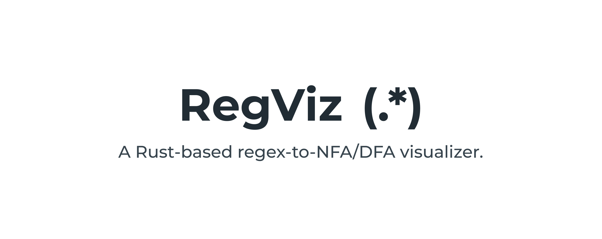

Welcome to RegViz, a Rust-based interactive tool for visualizing and understanding the equivalence between regular expressions and finite automata, developed as a final project for COT 4210 Automata Theory & Formal Languages at USF.

## Overview

This project implements a complete pipeline for converting regular expressions into finite automata representations, demonstrating fundamental concepts from automata theory. Students and educators can use this tool to observe how regular expressions transform into NFAs and DFAs, test string membership, and explore automata behavior interactively.


### Problem Statement

While tools for visualizing regular expressions and automata exist, most are outdated, proprietary, or limited in functionality. Students often learn the theoretical equivalence between regular expressions and finite automata without a modern, hands-on way to observe the transformation process. This project addresses that gap by providing a transparent, from-scratch implementation that reveals each step of the conversion.

## Native App (Downloadable)

The native desktop app is the primary distribution. It runs with Iced.

Build and run (debug):

```bash
cargo run -p regviz_app
```

Build a release binary:

```bash
cargo build -p regviz_app --release
```

Resulting binary: `target/release/regviz_app`

## Web Preview (Optional)

An optional web build is provided (WASM via Trunk) and deployed to GitHub Pages.

### Prerequisites (local web build)

- Rust (stable) and Cargo
- Add the WASM target: `rustup target add wasm32-unknown-unknown`
- Trunk: `cargo install trunk` (or use prebuilt binaries)

### Serve locally

From `regviz_app/`:

```bash
trunk serve --open
```

## Running

The project is split into two main components: a backend library and a frontend application.

## Frontend

The frontend has been set as the default package for the workspace. To build and run the frontend, use the following commands:

Building:
```bash
cargo build
```

Running:
```bash
cargo run
```

### Backend

Building:
```bash
cargo build --package regviz_core
```

Running tests:
```bash
cargo test --package regviz_core
```

The backend also has a CLI binary tool for quick testing:
```bash
cargo run --package regviz_core -- <regular_expression> <test_string>
```

